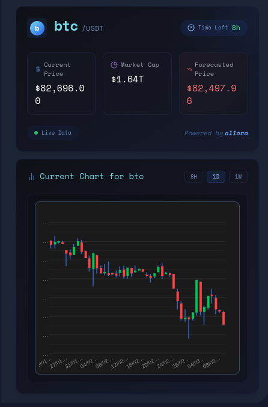
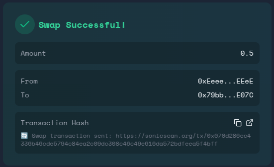
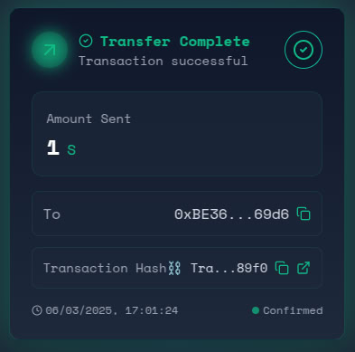

<div align="center">


<h1>
   AI ONE
</h1>
  
</div>

# INTRODUCTION

AI ONE is an all-in-one AI-powered chat platform designed for managing DeFi transactions across the Sonic platform and various blockchain networks. It simplifies actions like token swapping, sending Sonic assets, and bridging cryptocurrencies between Solana and Sonic. With features like an integrated rug check tool for assessing token safety, real-time multichain price predictions, and easy access to token balances and ticker updates, AI ONE enhances the DeFi experience, making it more intuitive and user-friendly.


## How does AI ONE WORK

AI One makes it easy to use Web3 DeFi. It combines several secure platforms into one simple chat that uses AI. If you want to send Sonic tokens to a friend or another address, AI One can help. You won’t need to search through different platforms or learn how to use them. AI One simplifies the process to ensure your tokens are sent safely.

With automatic slippage for transfers and an easy way to collect data using natural language, users can quickly send Sonic tokens from one wallet to another. This is just one of the features that AI One offers.

Let me help refine that section to be clearer and more professional while maintaining the same structure and information:

## Quick Usage Guide

> **Important Note**: AI One agent is currently in development. While deployed on mainnet, it is recommended not to use it for large asset transactions at this time. This project was developed for the Sonic EVM DeFi hackathon and is undergoing continuous improvement and development.

### Website Access

- Access AI One through: coming soon

### Setup

> Currently we are using one fixed wallet for this transaction for the submission of the Sonic DefAi Hackathon

Send Sonic Mainnet tokens to the address specified in the app for you to perorm defi action

## Flagship features

- **Voice Recognition (Speech to Text Command)**  
  This feature enables users to interact with your platform through voice commands, converting spoken words into text-based actions. It provides hands-free operation, allowing users to execute transactions, access information, or navigate the interface by simply speaking, which dramatically improves accessibility and convenience, especially for users on mobile devices or those with accessibility needs.

- **Contact List for Automatically Storing Addresses**  
  This functionality saves user addresses automatically in a secure contact list, eliminating the need to manually copy and paste long wallet addresses. Users can assign custom names to addresses and access them with a single click when initiating transactions, significantly reducing the risk of errors and streamlining the transfer process.

- **Token Contact List**  
  Users can perform transfer operations with just the contact name, simplifying the transaction process. This feature allows users to store and manage token addresses alongside user addresses, creating a comprehensive contact management system that makes transfers intuitive and reduces the chance of sending tokens to incorrect addresses.

- **Zerepy Integration**  
  Zerepy is the AI agent framework used to power all Sonic DeFi activities. This integration brings advanced automation and intelligent processing to your platform, enabling complex DeFi operations to be executed with minimal user input while maintaining security and efficiency across the ecosystem.

- **Allora Integration**  
  The Allora price prediction API provides accurate forecasting for cryptocurrency prices, helping users make informed investment decisions. This integration delivers data-driven insights on potential market movements, supporting strategic timing for buying, selling, or holding assets based on sophisticated predictive models.

- **Rug Check Integration**  
  The Rug Check integration provides automated security scanning of crypto projects and smart contracts, helping users identify potential scams or vulnerabilities before investing. This tool analyzes code patterns, team information, liquidity locks, and other security factors to produce risk assessments, protecting users from fraudulent projects and enhancing overall platform safety.

## Core Functionalities

### Token Ticker Lookup

This feature enables users to retrieve token ticker symbols by providing a contract address on the Sonic EVM network. The system interfaces directly with Sonic's blockchain infrastructure to display the token's official ticker symbol. This functionality is handy for verifying token identities, especially when dealing with new or unfamiliar tokens, as it pulls the verified ticker information directly from the smart contract.

**Example Interaction:**

```
User: "What is the ticker for ANON?"
AI One:
```


### Price prediction (Allora Integration Overview):

We have successfully integrated the Allora API into our project to enhance price prediction capabilities for tokens. This integration allows our chatbot to provide users with precise price forecasts while offering a comprehensive user interface that displays essential data about each coin.

The UI includes detailed analytics and visual charts for the tokens being analyzed, creating a holistic DeFi experience for traders. Users can easily access vital information and gain insights into market trends, effectively streamlining their trading decisions. With Allora's integration, we empower users with real-time predictions and a user-friendly platform to enhance their trading strategies.

Future price, market data and chart for analysis on one prompt from user

Example:

```
Predict the future price of btc
```



### Balance Check

This feature enables users to query and view token balances for any wallet address on the Sonic network. It provides real-time balance information for all compatible tokens associated with the specified wallet, including native tokens and ERC-20 tokens. The balance check functionality interfaces directly with the Sonic blockchain to ensure accurate and up-to-date information.

**Example Interaction:**

```
user: "Balance Check wallet address: 0x11CaeF1EF6FAd2A9e8987051Ca5bfC869F11dE7A token to check: 0x79bbF4508B1391af3A0F4B30bb5FC4aa9ab0E07C"
AI one:
```


### Rug Check Feature

This feature provides comprehensive token analytics and metrics for any token on the Solana network. By querying the token's address, users can access detailed tokenomics data including total holder count, trading volume statistics, market activity, and the token's metadata. The system interfaces with Solana's blockchain to fetch real-time data, providing insights such as current holder distribution, total supply, circulating supply, trading volume over different time periods, and the token's official description from its metadata.

**Example Interaction**

```
user: "Hey, I'm looking to buy this token i saw in a random tg group, can you rug check 7uYB173CxJAtKMRaNvaJs6urUDNcknrGURCRUkhZCzyX "
AI One:
```


Let me enhance both feature descriptions to be more comprehensive and technically detailed:

### Swap Token Feature

This feature enables seamless token swaps on the Sonic network through an AI-powered natural language interface. Users can execute token exchanges by simply specifying their desired swap amount and token pairs. The system leverages the Zerepy agent framework to process these requests, automatically routing transactions through verified and audited smart contracts. The swap mechanism incorporates optimal routing algorithms and automatic slippage protection to ensure efficient token conversions at the best available rates.

The swap functionality interfaces directly with Sonic's liquidity pools to determine optimal exchange paths, and includes gas fee estimation, price impact calculations, and transaction confirmation processes. All executed swaps are fully traceable via transaction hashes provided in the response.

**Example Interaction:**

```
User: "swap amount 0.3 from 0x79bbF4508B1391af3A0F4B30bb5FC4aa9ab0E07C to 0xEeeeeEeeeEeEeeEeEeEeeEEEeeeeEeeeeeeeEEeE"
AI ONE:
```



### Transfer Token Feature

This feature enables secure, frictionless transfers of native SONIC tokens and other ERC-20 assets between wallets on the Sonic network. Through natural language commands, users can initiate token transfers by specifying the recipient address and amount. The system handles all transaction details including gas optimization, transaction validation, and confirmation processes.

The transfer functionality implements multiple security measures including address validation, transaction signing, and confirmation systems. Each transfer is executed through verified smart contract interactions, with complete transaction details and Explorer links provided for verification.

**Example Interaction:**

```
User: "Transfer 1 S token to address: 0xBE36b98C7DBCd22dad2a8Ce09A08A3877D3C69d6"
AI ONE: "Transfer initiated:
- Sending: 1 SONIC
- To: 0xBE...9D6
- Transaction hash: 0x45f1...b2e7
- Status: Confirmed
- View transaction: [Sonic Explorer Link](https://sonicscan.io/tx/0x45f1...b2e7)"
```



## Future Features Roadmap

Based on user feedback and our development vision, the following features are planned for future integration into the AI One platform:

### 1. Cross-Chain Bridge Integration

This feature will expand AI One's capabilities beyond the Sonic network, allowing users to bridge assets between multiple blockchains through simple conversational commands. Users will be able to move tokens across networks with automated verification and gas optimization.

**Example Interaction:**

```
User: "Bridge 10 SONIC to Ethereum as ETH"
AI ONE: "Initiating cross-chain transfer:
- Source: 10 SONIC on Sonic Network
- Destination: ~0.005 ETH on Ethereum
- Estimated completion time: 10-15 minutes
- Bridge fee: 0.5 SONIC
Would you like to proceed?"
```

### 2. DeFi Yield Optimization

This feature will enable users to deposit tokens into various yield-generating protocols on the Sonic ecosystem. AI One will analyze current APYs across multiple platforms and recommend optimal strategies based on user risk preferences and investment timeframes.

**Example Interaction:**

```
User: "What are the best yield options for my SONIC tokens?"
AI ONE: "Current yield opportunities for SONIC:
- SonicSwap Liquidity Pool: 12.5% APY (medium risk)
- SonicStake Protocol: 8.2% APY (low risk)
- SonicYield Farm: 18.7% APY (higher risk)
Would you like details on any specific option?"
```

### 3. Portfolio Analytics & Insights

This comprehensive analytics feature will provide users with detailed insights into their on-chain activities, portfolio performance, and market trends. The system will generate personalized reports including profit/loss calculations, gas expenditure analysis, and portfolio diversification recommendations.

**Example Interaction:**

```
User: "Analyze my portfolio performance"
AI ONE: "Portfolio Analysis for 0xabc...123:
- Total Value: $12,450 (+15.2% MTD)
- Asset Allocation: 45% SONIC, 30% stablecoins, 25% other tokens
- Highest Performer: $ANON (+32% this month)
- Gas Expenses: $12.50 (last 30 days)
- Recommended Actions: Consider rebalancing to increase stablecoin exposure"
```

### 4. Limit Order & Trading Automation

This feature will allow users to set conditional orders and automated trading parameters through conversational commands. Users can create limit orders, stop-losses, and recurring purchase plans that execute automatically when conditions are met.

**Example Interaction:**

```
User: "Set a limit order to buy $ANON when it drops to 5 USDC"
AI ONE: "Limit order created:
- Buy: $ANON
- Trigger price: 5 USDC
- Amount: [Please specify amount]
- Expiration: 7 days (default)
I'll monitor the market and execute this order when the price condition is met."
```

### 5. NFT Integration & Marketplace Access

This feature will expand AI One's functionality to include NFT interactions on the Sonic network. Users will be able to view their NFT collections, check floor prices, receive notifications about relevant drops, and execute marketplace transactions through simple commands.

**Example Interaction:**

```
User: "Show me my NFT collection"
AI ONE: "Found 3 NFTs in wallet 0xabc...123:
- SonicPunk #1234 (Current floor: 50 SONIC)
- Cosmic Creature #789 (Last sold: 25 SONIC)
- Genesis Pass #42 (Utility: Access to SonicVerse)
Would you like to view any specific NFT details or marketplace listings?"
```
